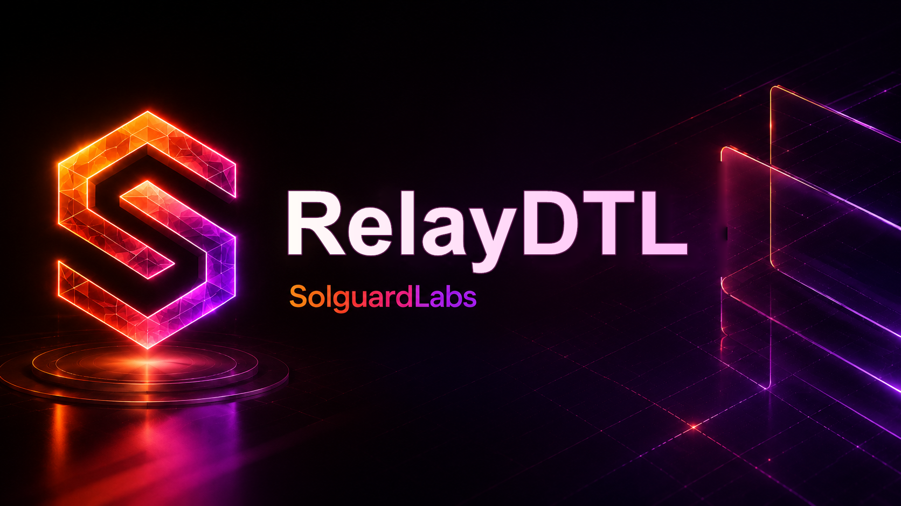

# RelayDTL



RelayDTL es un relayer economico para mensajes DTL entre nodos. El servicio
mantiene reservas por cuenta, bloqueos por mensaje, receipts de entrega,
confirmaciones ponderadas, expiraciones y settlement final de pagos a
beneficiarios y operadores.

El proyecto modela un entorno de auditoria de protocolo: no necesita servicios
externos, expone un binario reproducible y permite ejecutar escenarios JSON
desde tests TypeScript.

## Componentes

- `cmd/relaydtl`: CLI para ejecutar escenarios locales.
- `src/`: motor Go del relayer, ledger, rutas, receipts, confirmaciones y
  settlement.
- `tests/node`: tests TypeScript de flujos de entrega, expiracion y rutas.
- `scripts`: validacion local y CI.

## Requisitos

- Go 1.22 o superior.
- Node.js 22 o superior.
- npm.

## Uso

Ejecutar un escenario de ejemplo:

```bash
go run ./cmd/relaydtl --demo
```

Ejecutar un escenario JSON:

```bash
go run ./cmd/relaydtl --scenario ./tests/fixtures/example.json
```

Ejecutar tests:

```bash
npm ci
npm test
go test ./...
```

Validacion completa:

```bash
bash scripts/ci.sh
```

## Modelo Operativo

Un mensaje DTL reserva saldo del pagador hasta que la red confirma una entrega
valida o hasta que expira. Cada receipt contiene el contexto de ruta observado,
el operador que preparo la entrega, una ventana temporal y el coste esperado.
Las confirmaciones de nodos tienen peso, estado y digest operativo. Cuando se
alcanza quorum, el settlement libera principal al beneficiario, fees al
operador y devuelve el excedente al pagador.

Las rutas pueden fallar por capacidad, latencia o ventana de entrega. El motor
incluye seleccion determinista de ruta alternativa para escenarios en los que
una ruta primaria no esta disponible.

## Estado Del Lab

RelayDTL esta preparado como repositorio de auditoria local. La documentacion
publica describe el protocolo esperado y los flujos operativos verificables.
